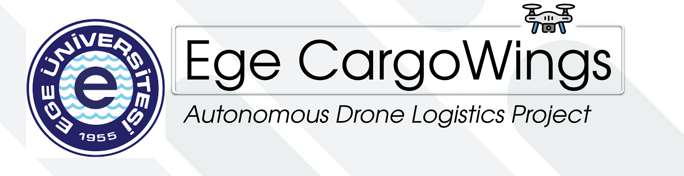

# *Machine Learning-Enhanced Swarm Drone System for Indoor Cargo Task Allocation Considering Non-Ideal Communication Factors*

## Project Description

**Objective**: The objective of this graduation project is to design and implement an advanced indoor cargo delivery system using a swarm of drones. This system will leverage machine learning algorithms to optimize task allocation among the drones while taking into account non-ideal communication factors that are commonly encountered in indoor environments.

## Components and Key Features

**Swarm Drone Fleet**: Develop a fleet of autonomous drones capable of indoor navigation and cargo handling. The drones should be equipped with sensors for obstacle detection and avoidance.

**Machine Learning Algorithms**: Implement machine learning models for real-time decision-making and task allocation. These models should consider factors such as cargo weight, drone battery levels, optimal path planning, and dynamic re-routing in case of obstacles.

---

### -  How to implement Machine Learning Algorithms?

- Defining the Machine Learning Objectives:

    This includes path planning, task allocation, obstacle avoidance, and communication optimization.

- Data Collection and Preprocessing:

    Gathering relevant data for training and testing your machine learning models. This could involve indoor maps, drone sensor data, communication logs, and historical task allocation data.
    Preprocess the data to make it suitable for training. This may include data cleaning, feature engineering, and data augmentation.

- Model Selection and Development:

    Choose appropriate machine learning algorithms and models for each of the defined tasks. For example:
    Path Planning: You might use reinforcement learning or deep Q-networks.
    Task Allocation: This could involve optimization algorithms, reinforcement learning, or deep learning approaches.
    Communication Optimization: Investigate techniques for adaptive communication and data transmission strategies.

- Integration with Drone System:

    Develop interfaces to integrate your machine learning models with the drone system's control software.
    Implement real-time data exchange between the drones and the central control system to enable decision-making based on model predictions.

--- 

**Non-Ideal Communication Factors**: Investigate and model the communication challenges typically encountered indoors, such as signal interference, limited bandwidth, and signal dropout. Develop strategies to mitigate these challenges and ensure reliable communication among the drones and a central control system.

**Task Allocation**: Create an intelligent task allocation algorithm that optimizes the distribution of cargo delivery tasks among the drones. This algorithm should prioritize factors like minimizing delivery time, energy efficiency, and load balancing among the drones.

---

### How to implement Task Allocation

- Defining the Task Allocation Problem:

     It's about allocating cargo delivery tasks among a swarm of drones while considering factors like minimizing delivery time, energy efficiency, and load balancing.

- Collecting Data:

    Gathering data related to the tasks to be allocated and the capabilities of the drones. This might include the location of delivery points, cargo weights, drone performance data, and battery levels.

- Objective Function:

    Create an objective function that combines the optimization objectives. For example, you can use a weighted sum of delivery time, energy consumption, and load balancing factors.

- Algorithm Selection:
    - Greedy algorithms
    - Genetic algorithms
    - Particle swarm optimization
    - Reinforcement learning (e.g., using deep - reinforcement learning for task allocation)

- Testing and Simulation

---

**Indoor Cargo System**: Design a cargo handling and delivery mechanism that allows the drones to pick up, transport, and safely deliver cargo indoors. Consider safety protocols for human interaction in shared indoor spaces.

 
 

## Expected Outcomes

A functioning swarm drone system capable of indoor cargo transport.
Machine learning algorithms for dynamic task allocation.
A communication system that adapts to non-ideal indoor conditions.
Real-world performance evaluation and optimization of the system.
Benefits:

This project combines cutting-edge technology in the fields of drones, machine learning, and communication systems. It addresses real-world challenges related to indoor cargo delivery, which has applications in logistics, warehouses, hospitals, and various other indoor environments. Additionally, it can contribute to the development of autonomous systems capable of working in complex, dynamic indoor spaces.